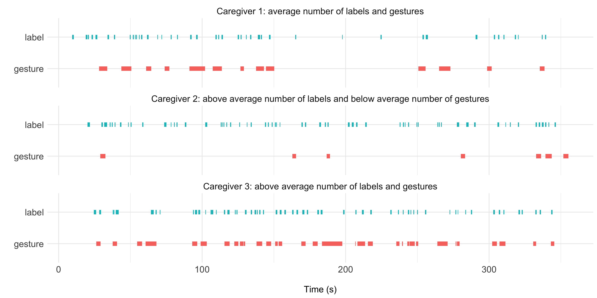
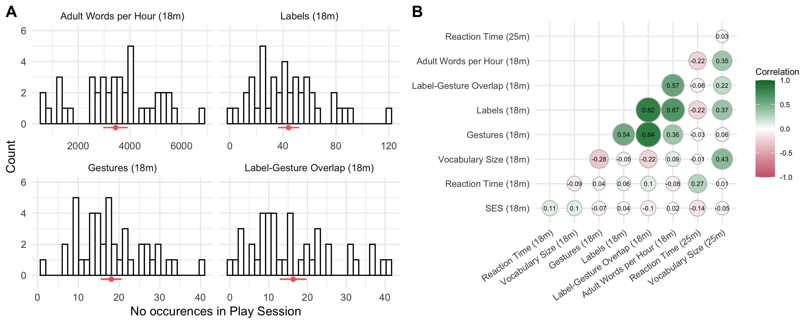

```{r setup, include = FALSE}
library(papaja)
library(tidyverse)
library(brms)

```

```{r analysis-preferences}
# Seed for random number generation
set.seed(42)
knitr::opts_chunk$set(cache.extra = knitr::rand_seed)
```

# Research highlights

* We examined the frequency of caregivers’ referential labels, referential gestures, and total words spoken to their 18-month-old children during a 5-min lab-based play interaction.

* We assessed the predictive power of referential labels, gestures, the combination of both, and total words spoken to 25-month-old children’s processing speed and vocabulary growth.

* Bayesian model comparisons showed that best-fitting models included caregivers’ referential labels at 18 months, though total words spoken also predicted later processing speed.

* Caregivers’ use of referential labels, more so than referential gestures, are a critical linguistic feature linked to children’s later vocabulary learning.

# Introduction

Children learn language through interactions with others. Studies of caregiver-child interactions have documented extensive variability in the frequency with which caregivers use verbal behaviors (e.g., words) and nonverbal behaviors (e.g., gestures) when they engage with their children. Individual differences among caregivers have been noted in studies of families across diverse linguistic, cultural, and socioeconomic status (SES) backgrounds [@hart_meaningful_1995; @hoff_specificity_2003; @casillas_early_2019; @weber_when_2017]. Moreover, variability in the frequency of caregivers’ use of verbal behaviors [@gilkerson_language_2018; @huttenlocher_early_1991; @rowe_longitudinal_2012; @weisleder_talking_2013; @shneidman_language_2012;@walker_prediction_1994] and nonverbal behaviors [@cartmill_quality_2013; @rowe_child-directed_2008; @rowe_differences_2009; @pan_maternal_2005] has been shown to be positively associated with children’s later language development.

There are multiple proposals to explain how caregivers’ verbal and nonverbal behaviors support later language learning. Both can be used to refer to objects and events. By using verbal behaviors, such as labels, in the presence of objects, caregivers support children’s learning of word-referent mappings, a critical step in children’s early comprehension and subsequent word production [@baldwin_infants_1993; @mcmurray_word_2012; @bohn_pervasive_2019]. Nonverbal behaviors, such as gestures, can also be used to refer to and communicate about the identity of referents (e.g., by pointing to, holding out, or giving a cup to someone). For example, caregivers’ deictic gestures, such as pointing, can help children disambiguate the referent of a label from other candidate referents [@rowe_pointing_2000; @iverson_gesturing_1999; @puccini_type_2010; @yuksel_encouraging_2017; @zukow-goldring_sensitive_1996; @tfouni1983discourse]. Labels and gestures can also be used together (e.g., saying “give me the cup,” while pointing to a cup), providing the child with two cues to reference in differing modalities. Thus, caregivers’ use of labels, gestures, or both together, can help children to map language onto specific concepts, strengthening their understanding of how language represents objects or events in their world. In this study, we compare Spanish-speaking caregivers’ use of verbal behaviors (i.e., total words and referential labels) and non-verbal behaviors (i.e., referential gestures) during a play session with their 18-month-old children. We then assess the degree to which these behaviors are linked to children’s language processing efficiency and vocabulary outcomes at 25 months.

## Variation in caregivers’ verbal and non-verbal behaviors

Documenting variability among caregivers in their frequency of communicative behaviors is critical for establishing links between these behaviors and later child outcomes. Verbal behaviors have been examined using numerous measures that capture the quantity and quality of caregivers’ speech – although they mostly do so ignoring the referential context. Using the LENA technology, @gilkerson_mapping_2017 collected day-long recordings of the speech children heard in 329 American families with 2- to 48-month-old English-speaking children from varying SES backgrounds. Speech recognition software provided automated estimates of the quantity of caregivers’ speech, i.e., adult word counts (AWC), revealing that children were exposed to as few as 8,000 and as many as 17,000 words in a 12-hour day. @bergelson_day_2019 collected LENA daylong recordings with 3- to 20-month-old children in 61 American families. Instead of total adult-word counts, they assessed variation in caregiver talk by measuring the amount of time each child was exposed to child-directed speech (CDS). The authors found that children were exposed to CDS for 11.36 min per hour, on average, with a standard deviation over a third of the mean (SD = 4.24 min). Studies of caregiver-child interactions in different sociocultural contexts, such as subsistence farming communities, have found that, children were exposed to far less speech, on average, than in other communities; however, there was still substantial variability among families [@bunce_cross-cultural_2020; @casillas_early_2019; @casillas2021early; @yuksel_encouraging_2017; @shneidman_language_2012]. Other studies have specifically examined caregivers’ use of nouns in verbal labels and noted variability among caregivers in multiple languages, including English, Italian, French, Spanish, Turkish, Mandarin, and Korean [@altinkamis_when_2014;@bergelson_what_2019; @choi_caregiver_2000; @rosemberg_nouns_2020; @tardif_caregiver_1997].

Substantial variability among caregivers in their use of nonverbal gestures is also well documented. Studies examining caregivers’ use of gestures have primarily focused on gestures that are symbolic or representational to some degree [rowe2022early], such as iconic gestures (e.g., flapping hands for a bird), conventional gestures (e.g., nodding one’s head to mean ‘yes’ in the US), and referential gestures (e.g., holding out objects or deictic gestures such as pointing). For example, @rowe_learning_2008 videotaped 90-min interactions in 53 English-speaking families with children from 14 to 34 months. They found that caregivers produced, on average, 100-115 symbolic, conventional, and deictic gestures, with values ranging from only a few gestures to over 400. Other studies have examined deictic gesture use in families speaking non-English languages and living in different sociocultural contexts, e.g., in families speaking Yucatec Mayan in Mexico [@salomo_sociocultural_2013] and Lazuri in Turkey [@yuksel_encouraging_2017], also noting extensive variability among caregivers in both groups.

Variability among caregivers in their use of verbal behaviors and gestures has been linked to child language outcomes. In some studies, language samples are used to capture variation in the frequency of young children’s production of recognizable words during interactions with their caregiver [@huttenlocher_early_1991]. In older school-age children, researchers have also reported links between frequency of caregiver verbal engagement and children’s scores on standardized tests of language, such as vocabulary [@gilkerson_language_2018].  When children are infants and toddlers, many studies rely on parent-reports assessments of children’s vocabulary size, such as the MacArthur-Bates Communicative Developmental Inventories [CDI, @fenson_macarthur-bates_2007], which ask parents to indicate which words their child “understands and says” from among several hundred words on a checklist [e.g., @weisleder_talking_2013].  Still other studies have explored links between caregivers’ verbal behaviors and children’s performance in tasks that capture skill at processing language in real time, such as the Looking-While-Listening task [@fernald_looking-while-listening_2008]. For example, in a sample of 27 Spanish-speaking caregiver-child dyads, @hurtado_does_2008 reported that children who experienced more speech from their caregivers during a lab-based play session were reported both to know more words on the CDI and were more efficient at recognizing spoken words in real time. @weisleder_talking_2013 reported similar findings based on estimates of caregivers’ child-directed word counts during day-long recordings.  In both studies, mediation models explored possible pathways among caregiver talk, vocabulary size, and processing efficiency. Results suggested that frequent engagement with caregivers may be “tuning up” children’s abilities to map real-time spoken language onto referents in the world around them, allowing for more efficient use of the input to support language learning. 

Links between caregivers’ use of gesture and children’s later vocabulary abilities have also been reported [@iverson_gesturing_1999; @rowe_child-directed_2008; @pan_maternal_2005]. @rowe_differences_2009 examined socioeconomically-diverse caregivers and children in the home across multiple visits, beginning when children were 14 months.  They found that variation among children in their gesture use at 14 months was related to their vocabulary skills at 54 months, measured using a standardized test. Importantly, this study and others have found that the frequency of caregivers’ gesture use is related to the frequency of children’s gesture use. In particular, caregivers’ use of deictic gestures, such as pointing, has been viewed as a potential means of influencing children’s own use of deictic gestures, an important prelinguistic skill [@goodwyn2000impact; @matthews_origins_2012; @rowe_pointing_2000; @rowe_differences_2009; @rowe_parent_2019]. Other studies propose that caregivers’ use of deictic gestures can support word learning by bringing attention to an object and reducing spatial ambiguity, thus allowing children to attend more effectively to the referent and/or the auditory signal [@rowe_pointing_2000; @iverson_gesturing_1999; @puccini_type_2010; @yuksel_encouraging_2017; @zukow-goldring_sensitive_1996; @tfouni1983discourse]. 


## Labels, gestures, or both?

Taken together, there is substantial evidence that how frequently caregivers use communicative behaviors is associated with children’s language learning.  However, few studies have directly contrasted the predictive relations to children’s outcomes from verbal versus non-verbal behaviors that establish reference. This referential function of labels and gestures is important because it serves as a means to support children’s early label-referent associations. Additionally, it is critical to remember that these behaviors frequently occur together in real time [@rowe_differences_2009; @iverson_gesturing_1999; @puccini_type_2010; @yuksel_encouraging_2017; @zukow-goldring_sensitive_1996; @tfouni1983discourse; @pan_maternal_2005]. Thus, it is difficult to address whether links between caregiver verbal or nonverbal behaviors and children’s outcomes may in fact be better explained by caregivers’ combined use of labels and gestures. For example, @rowe_pointing_2000 proposed that there may be a shared construct underlying caregivers’ use of verbal behaviors and gestures, such as communicativeness. This hypothesis is supported by evidence of a small to moderate positive correlation between the frequency of caregivers’ verbal behaviors and gestures; those caregivers who used more total words also gestured more frequently than caregivers who used fewer words [@rowe_differences_2009;  @salo_does_2019; @rowe_pointing_2000; @rowe_child-directed_2008; @pan_maternal_2005]. In the present study, we ask if the predictive power of caregivers’ communicative use of reference may be captured more fully by measures that reflect the combined use of referential labels and gestures, rather than each measure taken alone. 

How caregivers combine labels and gestures in real time has been widely discussed in the experimental literature on early word learning [@gogate_study_2000; @tincoff_feeling_2019; @de_villiers_rader_caregivers_2012; @zukow-goldring_sensitive_1996]. For example, @kalagher_effects_2006 found that novel word learning was more successful when caregivers introduced words while narrating a story and pointing to the objects than when narrating a story without pointing. @gogate_study_2000 examined European American and Hispanic American families residing in a major metropolitan area in the United States. They found that when they were teaching novel labels to young infants, caregivers were more likely to use labels while moving objects. Moreover, caregivers of linguistically less-advanced infants, compared to more-advanced infants, were those who were more likely to synchronize labels with object motion.  These findings suggest that caregivers are sensitive to children’s level of language skills when using labels and gestures together to highlight new label-referent associations. 

## The Current Study

In this longitudinal study, we observed 42 Spanish-speaking caregivers during play interactions with their 18-month-old children. We coded the frequency and duration of caregivers’ referential labels to objects and referential gestures to objects. At 25 months, children’s language skills were assessed using an on-line language processing task and caregiver reports of productive vocabulary size. Bayesian methods were used to construct different models of the frequency of caregivers’ use of labels, gestures, and both in combination, as predictors of child outcomes.
We predicted that if children’s later language abilities are best predicted by the frequency of caregivers’ use of labels or gestures taken independently, this would suggest a primary role for learning based on either modality. However, if language learning is supported more by the frequency of caregivers’ use of reference across verbal and nonverbal modalities, then one or more models including both labels and gestures would be stronger predictors of our measures of language outcomes [@cartmill_quality_2013]. We also included a model capturing the total number of words spoken by caregivers to explore the specificity of caregivers’ use of referential labels, in contrast to overall talkativeness. By comparing these models, we asked what is the smallest set of caregiver’s communicative behaviors that best predicts children’s language outcomes at 25 months.

# Methods

```{r}
socpop <- read_csv("../stats/data/tidy_data.csv")
```
```{r}
sample <- socpop%>%
  summarise(n = length(unique(id)))

origin <- socpop%>% 
  group_by(L1PRE_mom_birth_country)%>%
  summarise(n = n())
```

## Participants

Participants were `r sample%>%pull(n)` primarily Spanish-speaking children^[As seen in our pre-registration, we determined a sample size of *n* = 50 based on a priori frequentist power analyses, but stopped at n = 43 because at the time of analysis there were no more available families to include in the study.] (`r sample%>%pull(n)` females) and their caregivers who were participating in a longitudinal study examining language development in primarily monolingual Spanish-speaking families in the US. Families were recruited from birth records or community contacts in Northern California and were excluded if the child was born preterm, had a known neurodevelopmental disorder, or loss of hearing or vision. As shown in Table X, children were approximately 18 months at the start of the study and approximately 25 months when we assessed language processing speed and vocabulary size. We calculated SES using the Hollingshead Index, which reflects education and occupation for both mothers and fathers. SES was included as a covariate based on prior studies [@daneri_maternal_2018; @hoff_specificity_2003; @huttenlocher_sources_2010], to examine the unique role of caregiver behaviors on children’s language skills over and above potential confounding variables.

Families represented a diverse range of SES backgrounds. All mothers reported that they were native Spanish speakers. All families lived in the US but the mothers were primarily born in Mexico (`r origin%>%filter(L1PRE_mom_birth_country == "mexico")%>%pull(n)`), with a few from Central  America (5). 

## Procedure

Native Spanish-speaking research staff met with the caregiver to explain study protocol, and all caregivers gave their informed consent prior to study participation. Caregivers participated in a videotaped lab-based play session with their 18-month-old children at a community laboratory.  Each caregiver was asked to engage with her child using a standard set of toys (e.g., plates, pretend food, cutlery, pots, doll) for approximately 5 min.  During the session, the child wore a LENA recorder placed inside a specially-designed vest to capture the adult speech spoken during the play session [@marchman_accuracy_2021]. At 18 and 25 months, children participated in the Looking-While-Listening task to assess spoken language understanding [@fernald_looking-while-listening_2008]. At both time points, caregivers completed parent-report assessments of their child’s productive vocabulary size [@jackson-maldonado_macarthur_2003]. 

## Measures

### Coding of caregiver referential gestures and labels. 

A native Spanish-speaker using ELAN [version 5.0; @wittenburg2006elan] coded all caregivers’ referential gestures and labels from the video recordings of the play sessions. Gestures were coded first without audio. Referential gestures were defined as those gestures used to attract infants’ attention to the toys or other objects in the environment. Gestures included holding out objects/giving, pointing, descriptive or iconic gestures (e.g., making a chopping motion with their hand), and touching with an open hand. Physically playing with toys was not included as a gesture (e.g., holding the knife and pretending to cut vegetables in front of the child).  A standardized protocol used to define the onset and offset of each gesture is available in our full codebook (https://osf.io/s2jqy). Frequency of gestures was derived for each caregiver, and the onset and offset of gestures were used for our overlap measure below.

Caregivers’ use of object labels was then coded by the same coder. The coder listened to the video and marked the onset and offset of all object labels that referred to objects in the play session. Frequency counts of label tokens were derived for each caregiver. Successive repetitions of a single label were counted as individual tokens. General category terms (e.g., “comida” [food], or “juguetes” [toys]) were excluded because our goal was to focus on specific labels rather than category names for available objects.  All English labels were excluded, given that we were assessing children’s later Spanish language outcomes. 

Finally, we determined the number of times that each caregiver produced an object label while using a gesture (overlaps: labels + gestures).  An R script used the duration coding of each label and gesture in the ELAN output to identify the number of labels that occurred within a 1-sec window before or after a gesture [@cartmill_quality_2013].  

Figure \@ref(fig:fig1) depicts examples of the final label and gesture coding for three caregivers over the 5-min observation window. These examples illustrate variation among caregivers in the overall frequency of labels and gestures, as well as variation in the number of overlapping labels and gestures. 

```{r fig1, include = T, fig.cap = "Examples from three participants chosen to illustrate the variability in frequency and duration of label and gesture use.  Ticks represent each instance and the size depicts the duration.  Caregiver 1 provided an average number of labels and gestures, Caregiver 2 provided an above average number of labels and a below average number of gestures, and Caregiver 3 provided an above average number of labels and gestures.", out.width="100%"}
 
```

### Reliability Coding. 

A second native Spanish-speaking coder coded labels and gestures for approximately 20% of the families (n = 8). The second coder was blind to the study hypotheses and to the coding by the first coder. Intraclass correlations (ICC) suggested strong reliability for number of labels (ICC = .996, 95% CI [.96, 1]), gestures (ICC = .89, 95% CI [.54, .98]), and overlaps (ICC = .99, 95% CI [.98, 1]).

### Caregiver verbal engagement during play session. 

During the play session, a LENA audio recorder was used to provide an estimate of the number of adult word counts (AWC) produced during the session.  The AWC measures generated by the LENA speech recognition software were converted to a rate per hour based on the 5-min sample, to account for minor differences in the duration of play sessions. This measure was included in the models as an estimate of overall caregiver talkativeness. 

### Spoken language processing  

At each time point, the child participated in the Looking-While-Listening task [LWL; @fernald_looking-while-listening_2008]. In this task, the child sits on their caregiver’s lap while viewing pictures of two familiar objects on a screen. After 2 sec, a voice of a female, native-Spanish speaker names one of the objects (e.g., “¿Dónde está el perro?”, Where’s the doggy?), followed by an attention-getter phrase (e.g., “¿Te gustan las fotos?, Do you like the pictures?). On each trial, the pictures were presented in fixed pairs, matched for salience, and the target words were matched in grammatical gender. At 18 months, auditory stimuli consisted of eight familiar words presented 6 times each as target and distracter. At 25 months, auditory stimuli consisted of twelve familiar words presented 4 times each as target and distracter. Each word in the pair served an equal number of times as target and distracter, for a total of 48 trials, with target picture counterbalanced across side across trials.

After a brief calibration session, trials were presented in two fixed pseudo-random orders such that the target picture was not presented on the same side for more than two trials in a row. Patterns of children’s eye-gaze were captured at 60 frames/sec by a Tobii X60 eye-tracker, mounted to the bottom of the monitor. A video camera attached to the top of the monitor also provided a record of children’s eye gaze across the full session.  All video-recordings of the testing sessions were prescreened to exclude trials when the child was inattentive or if there was any concern that the caregiver was biasing the child. Based on which picture the child was fixated at target noun onset, trials were defined as distracter or target initial. Trials on which the child was not looking at either picture at target noun onset were not analyzed. Trials were also later removed on a child-by-child basis if the parent reported that the child did not know the target word. Due to calibration failures or experimental error, some portion of the sessions (11/42, 26%) were hand-coded by trained coders following standard protocols [@fernald_looking-while-listening_2008]. Processing speed was calculated on all distracter-initial trials as the mean reaction time (RT) in milliseconds to shift from the distracter to the target picture measured from the onset of the target noun. Trials were excluded if shifts were faster than 300 ms or slower than 1800 ms from target noun onset, since these shifts are not likely to be in response to the target word. Given that children could have different numbers of distracter-initial trials, the mean number of trials per child varied (M = `r round(mean(socpop$rt_25m_ntrials, na.rm = T),2)`, SD = `r round(sd(socpop$rt_25m_ntrials, na.rm = T),2)`), however, all children had at least 2 trials contributing to the computation of RT (range = `r range(socpop$rt_25m_ntrials, na.rm = T)[1]` – `r range(socpop$rt_25m_ntrials, na.rm = T)[2]`). 

### Vocabulary size

Children’s vocabulary size in Spanish was assessed at each time point by parent report with the MacArthur-Bates Inventarios del Desarollo de Habilidades Communicativas [CDI; @jackson-maldonado_macarthur_2003]. These instruments ask parents to indicate what words their child can “understand and say” from a list of hundreds of items.  At 18 months, some parents completed the Inventario I form and others completed Inventario II form, due to slight changes in protocol over time. For those children whose parents completed Inventario I, scores were converted to proportions based on the number of items on the Inventario II form. At 25 months, all parents completed Inventario II. Vocabulary size was the number of words chosen (680 words maximum). Due to missing data, 37 families are included for analyses with the CDI.

## Analysis Strategy

We first present descriptive statistics of all variables at 18 and 25 months. We then present a series of Bayesian model comparisons that allowed direct comparisons of non-nested models to examine the predictive roles of labels, gestures, or their combination (i.e., overlaps), on child outcomes [@mahr_using_2018; @donnellan_infants_2020]. This approach contrasts with prior studies that seek to isolate unique contributions of caregivers’ verbal behaviors or gestures to outcomes using nested hierarchical regression [@iverson_gesturing_1999; @pan_maternal_2005]. We compared seven independent models, each representing a different hypothesis about how caregivers’ communicative behaviors contribute to children’s language processing speed and vocabulary size at 25 months.  These models assessed the independent contributions of labels and gestures, the conditional relation between labels and gestures, as well as the overlapping use of labels and gestures (overlap). We also tested a model including AWC, to rule out the effects of caregiver talkativeness. All models controlled for SES and 18-month vocabulary size and processing speed as appropriate, depending on the model. By including 18-month language skills, we can ask the more specific question of which input variable(s) best predict gains in language processing or vocabulary size over and above SES and children’s earlier language skills.

For each dependent variable (dv), we compared the same set of models^[The preregistration did not include a) the adult word count model and b) the baseline model. We added these models later a) to see if the number of labels was simply an indicator of overall caregiver talkativeness and b) to be able to judge if the inclusion of predictors improved predictions at all.]: (1) `dv ~ labels`; (2) `dv ~ gestures`; (3) `dv ~ overlaps`; (4) `dv ~ adult_words_per_hour`, which considers all speech using AWC; (5) `dv ~ labels + gestures`, which assumes that both labels and gestures contribute independently; (6) `dv ~ labels * gestures`, which assumes that the contribution of labels and gestures are conditional on one another, and (7) `dv ~ covariates` is the baseline model.  If a model performs at or worse than the baseline, its predictor(s) do not contribute to predicting gains in processing or vocabulary over and above the covariates.

All models were fit in a Bayesian framework as linear models in `R` [@citeR] via the function `brm` from the R-package `brms` [@burkner2017brms] using default priors for all model parameters. All caregiver behavior variables were scaled to have a mean of 0 and a standard deviation of 1. Following @mcelreath2020statistical, we compared models using WAIC (widely applicable information criterion) scores and weights, an indicator of the model’s predictive accuracy for out-of-sample data; models with lower scores are preferred. Roughly speaking, WAIC scores reflect the model’s predictive accuracy with a penalty for the number of effective parameters. As such, model comparisons favor simpler models and thereby guard against overfitting. WAIC weights are an estimate of the probability that each model (compared to all models considered) will make the best predictions on new data. We next inspected the posterior distributions of the model predictors in the best models via their means and 95% credible intervals (CI) to inform the nature (positive or negative) and strength of the influence of the respective caregiver engagement variable on the dependent variable. 

# Results

## Descriptive statistics

```{r fig2, include = T, fig.cap = "A) Descriptive distribution of independent variables with mean and 95\\% CI (in red), B) Zero-order correlations between dependent variables and input variables. Circle size and color intensity increase with the absolute magnitude of correlation.", out.width="100%"}
 
```

Figure \@ref(fig:fig2)A provides descriptives for the four measures of caregiver communication. Caregivers produced approximately 3500 words per hour (M = `r round(mean(socpop$awc_phr_18m,na.rm = T),2)`, SD = `r round(sd(socpop$awc_phr_18m,na.rm = T),2)`, range = `r round(range(socpop$awc_phr_18m,na.rm = T)[1],2)` - `r round(range(socpop$awc_phr_18m,na.rm = T)[2],2)`), on average, based on the automated LENA counts. Caregivers produced just over 40 labels (M = `r round(mean(socpop$labels,na.rm = T),2)`, SD = `r round(sd(socpop$labels,na.rm = T),2)`, range = `r round(range(socpop$labels,na.rm = T)[1],2)` - `r round(range(socpop$labels,na.rm = T)[2],2)`) and about 18 gestures (M = `r round(mean(socpop$gestures,na.rm = T),2)`, SD = `r round(sd(socpop$gestures,na.rm = T),2)`, range = `r round(range(socpop$gestures,na.rm = T)[1],2)` - `r round(range(socpop$gestures,na.rm = T)[2],2)`). When considering overlaps, caregivers produced about 15 labels that were also accompanied with a referential gesture, (M = `r round(mean(socpop$labels_w_gestures,na.rm = T),2)`, SD = `r round(sd(socpop$labels_w_gestures,na.rm = T),2)`, range = `r round(range(socpop$labels_w_gestures,na.rm = T)[1],2)` - `r round(range(socpop$labels_w_gestures,na.rm = T)[2],2)`). 

Figure \@ref(fig:fig2)B shows the zero-order correlations among all variables. As expected, the three measures capturing caregivers’ language (AWC per hour, labels, overlaps) were significantly correlated. Numbers of referential gestures also correlated with verbal behavior variables, suggesting some shared underlying variance. However, none of the correlations indicated that any two measures were redundant (i.e., all r < .90), which justifies assessing their independent predictive relation to the dependent variable in the model comparison. 

## Spanish language processing

```{r tab1}
model_comp_rt <- readRDS("../stats/saves/rt_overview.rds")%>%
  filter(Model != "label_awc")%>%
  mutate(Model = recode(Model,
         label = "Labels",
         awc  = "Adult words per hour",
         null = "Baseline (covariates only)",
         label_gesture = "Labels + gestures",
         overlap = "Label-gestures overlap",
         gesture = "Gestures",
         label_gesture_int = "Labels * gestures")
  )

apa_table(
  model_comp_rt
  , caption = "WAIC scores and weights for models predicting language processing speed."
  , escape = TRUE
)
```

```{r}
model_rt_label <- readRDS("../stats/saves/model_rt_label.rds")

rt_model <- fixef(model_rt_label)%>%as_tibble(rownames = "term")
```
Table \@ref(tab:tab1) shows WAIC scores and weights for each model predicting children’s language processing speed (RT). Only two models outperformed the baseline model: labels and AWC per hour, with both models similar in their weights (model weights: `r model_comp_rt%>%filter(Model == "Labels")%>%pull(weight)` labels; `r model_comp_rt%>%filter(Model == "Adult words per hour")%>%pull(weight)` AWC per hour). None of the models that included gestures, either as the only test predictor or in combination with labels, made better predictions compared to the baseline model than models that included labels. Thus, children’s language processing speed at 25 months was best predicted by models that included some form of caregivers’ verbal behavior as predictors.

Figure \@ref(fig:fig3)A-i shows the posterior distribution of the model estimates for number of labels to be negative ($\beta$ = `r rt_model%>%filter(term=="labels")%>%pull(Estimate)`) and largely different from 0 (95% credible interval (CrI) = `r rt_model%>%filter(term=="labels")%>%pull(Q2.5)` - `r rt_model%>%filter(term=="labels")%>%pull(Q97.5)`). This speaks for a positive relation: the more labels the caregiver used at 18 months, the more the child improved in their reaction time from 18 to 25 months. However, the fact that the 95% CrI included zero, cautions against an overly strong interpretation. The effect of SES was similar. Children from families higher in SES tended to have greater developmental gains in reaction time, however, this effect was weak in magnitude ($\beta$ = `r rt_model%>%filter(term=="ses_18m")%>%pull(Estimate)`, 95% CrI = `r rt_model%>%filter(term=="ses_18m")%>%pull(Q2.5)` - `r rt_model%>%filter(term=="ses_18m")%>%pull(Q97.5)`). Finally, children with a slower reaction time at 18 months were also slower at 25 months ($\beta$ = `r rt_model%>%filter(term=="rt_18m")%>%pull(Estimate)`, 95% CrI = `r rt_model%>%filter(term=="rt_18m")%>%pull(Q2.5)` - `r rt_model%>%filter(term=="rt_18m")%>%pull(Q97.5)`). Figure A-ii shows the observed vs. predicted values from the model with labels as the test predictor.

```{r fig3, include = T, fig.cap = "Left: Posterior distributions for model estimates, right: model predictions. On the left, the green area denotes the section of the distribution that is supportive (i.e. faster reaction time and larger vocabulary). Points below each distribution show means, and error bars show 80\\% (thick) and 95\\% (thin) CrIs.  A-i shows the posterior distribution of all model estimates in the labels model for reaction time. B-i shows the same in the model predicting vocabulary size. On the right, A-ii and B-ii contrast the observed (black) values with the values predicted by the model (red) for reaction time (A) and for vocabulary size (B).", out.width="100%"}
knitr::include_graphics("../stats/figures/fig.3.png") 
```

## Vocabulary size

```{r tab2}
model_comp_cdi <- readRDS("../stats/saves/cdi_overview.rds")%>%
  filter(Model != "label_me",
         Model != "rel_overlap",
         Model != "label_awc")%>%
  mutate(Model = recode(Model,
         label = "Labels",
         awc  = "Adult words per hour",
         null = "Baseline (covariates only)",
         label_gesture = "Labels + gestures",
         overlap = "Label-gestures overlap",
         gesture = "Gestures",
         label_gesture_int = "Labels * gestures")
  )

apa_table(
  model_comp_cdi
  , caption = "WAIC scores and weights for models predicting vocabulary size."
  , escape = TRUE
)
```

```{r}
model_cdi_label <- readRDS("../stats/saves/model_cdi_label.rds")

cdi_model <- fixef(model_cdi_label)%>%as_tibble(rownames = "term")
```

Table \@ref(tab:tab2) shows the model comparisons for vocabulary size.  All predictor models made better predictions compared to the baseline model. As with RT, the model including the number of labels produced by the caregiver made the best predictions -- this time, however, it clearly outperformed all the other models (model weight = `r model_comp_cdi%>%filter(Model == "Labels")%>%pull(weight)`). Models including gestures were given more weight only when they also included labels.  
	
As shown in Figure \@ref(fig:fig3)B-i, the posterior distribution for the model estimate for labels was positive, large and reliably different from 0 ($\beta$ = `r cdi_model%>%filter(term=="labels")%>%pull(Estimate)`, 95% CrI = `r cdi_model%>%filter(term=="labels")%>%pull(Q2.5)` - `r cdi_model%>%filter(term=="labels")%>%pull(Q97.5)`). Children who heard more labels at 18 months increased more in their reported vocabulary size from 18 to 25 months. SES had a weak effect ($\beta$ = `r cdi_model%>%filter(term=="ses_18m")%>%pull(Estimate)`, 95% CrI = `r cdi_model%>%filter(term=="ses_18m")%>%pull(Q2.5)` - `r cdi_model%>%filter(term=="ses_18m")%>%pull(Q97.5)`). Finally, children who had a larger reported vocabulary at 18 months also had a larger reported vocabulary at 25 months ($\beta$ = `r cdi_model%>%filter(term=="cdi_18m")%>%pull(Estimate)`, 95% CrI = `r cdi_model%>%filter(term=="cdi_18m")%>%pull(Q2.5)` - `r cdi_model%>%filter(term=="cdi_18m")%>%pull(Q97.5)`). Figure \@ref(fig:fig3)B-ii shows the observed versus predicted values from the model with labels as the test predictor.

## Comparing the contribution of labels and gestures

The model comparisons suggested that including the number of gestures as a predictor did not contribute to a model’s predictive accuracy above baseline for RT, although gestures performed better than baseline for vocabulary size. Nevertheless, it is still interesting to see how the number of gestures related to the dependent variable in the different models. Thus, we compared the posterior distributions of the model estimates for labels and gestures across the models that included them. Figure \@ref(fig:fig4) shows this comparison. Looking first at labels, regardless of model, the supportive contribution of labels was stable whether tested as the only predictor or together with gestures for both reaction time and vocabulary size. In contrast, gestures only supported the outcome of vocabulary growth when considered as the sole test predictor. When combined with labels, the model estimates were essentially zero. This pattern affirms the conclusion based on the model comparisons, i.e., that knowing the number of gestures in the input -- in addition to the number of labels - did not improve predictions. 

```{r fig4, include = T, fig.cap = "Comparing estimates for labels and gestures across models. Points show means of the posterior distribution (95\\% CrIs) for the estimates. Estimates were extracted from all models that included one or both of the predictors.", out.width="100%"}
knitr::include_graphics("../stats/figures/fig.4.png") 
```

# Discussion

Our goal was to compare variation among Spanish-speaking caregivers in the number of words, labels, gestures, and combined labels and gestures used when interacting with their toddlers, in order to determine the smallest set of caregivers’ communicative behaviors that best predicted children’s language outcomes at 25 months. We found that over and above SES and children’s earlier language skills, variability in caregivers' use of referential labels was the strongest predictor of children’s processing speed and vocabulary, when pitted against variability in referential gestures or in different combinations of labels and gestures. Caregivers’ total words predicted children's later language processing speed but not their vocabulary. We discuss two questions raised by the results: Why might caregivers’ use of referential labels predict children’s later language processing efficiency and vocabulary size? Why are labels more predictive than gestures? 

## Why might caregivers’ use of referential labels predict children’s language processing efficiency and vocabulary size?

Those caregivers who used more labels also used more words overall (Figure \@ref(fig:fig2)B), reflecting an r2 of 45% shared variance and demonstrating a strong relation between these measures. However, while both measures of talk predicted reaction time, only caregivers’ use of labels better predicted both outcomes of children’s language processing and their vocabulary size. One possibility is that the frequency of caregiver labels is more closely linked to children’s understanding of word meaning, which is reflected in outcome measures of both language processing and vocabulary size. Labels themselves are symbols that refer to the objects, ideas, or events they represent [@acredolo_symbolic_1988; @bates_integrating_1989; @colonnesi_relation_2010], and both the mapping of a label to a referent and the learning of a label for a referent are directly assessed in both of our outcome measures. Language processing speed reflects children’s ability to map a spoken object name in real time onto one of two familiar pictures, assessed only on trials when the child demonstrates a clear shift from the distracter to the target picture. Thus, this task taps into children’s familiar knowledge of these everyday objects where children who are faster at processing the object label may have stronger conceptual and linguistic representations than those who are slower. Vocabulary size, as reported by parents on the CDI, reflects children’s abilities to produce the names of objects and concepts. Therefore, variation among caregivers in the frequency of specific use of referential labels may provide a closer link to individual differences in children’s linguistic knowledge about objects or events. While caregivers’ use of total words use may help ‘tune’ up children’s language processing speed, and provide children with the practice of hearing language, caregivers’ use of labels, in particular, specifically provides the linguistic information that enables early word learning. These results suggest that during early stages of language learning, repeated and varied exposure to labels embedded within day-to-day conversations may help children associate, prune, and strengthen these links [@mcmurray_word_2012], quickly process how labels map onto objects in real time [@fernald_picking_2006], and build a vocabulary that reflects their understanding about the world [@weisleder_talking_2013]. 

## Why are labels more predictive than gestures? 

Caregivers who used more referential labels were those who used more referential gestures, (*r* = .55; Figure \@ref(fig:fig2)B). The strength of this association is within expectations based on prior studies of children across a broad age range (i.e., 8 to 36 months), in spite of slightly different operationalizations of total words, labels, and gestures [e.g., @pan_maternal_2005: *rs* = .35 - .54; @rowe_pointing_2000: *r* = .58; @rowe_differences_2009: *r* = .67; @salo_does_2019: *r* = .30; @salomo_sociocultural_2013: *r* = .63]. However, we did not find support for our hypothesis that an underlying shared characteristic of caregivers’ communicative reference across referential labels and gestures was predictive of children’s language skills [@rowe_pointing_2000; @rowe_learning_2008]. Instead, it was the frequency in caregivers’ use of labels that best predicted later language outcomes. Rather than the shared referential function that both labels and gestures serve, there is information in the linguistic signal specifically associated with label use that supports children’s later vocabulary outcomes. 

It is important to note that as in previous studies, our measures of referential labels and gestures were not mutually exclusive. Labels may have occurred alone in an utterance or embedded in a multi-word utterance, with each instance co-occurring with a variety of socio-pragmatic behaviors such as eye-gaze, facial expressions, body movement, in addition to referential and non-referential gestures. Our findings suggest that variability in caregivers’ use of referential labels, regardless of how these labels are combined with nonverbal behaviors, is most strongly associated with later vocabulary in 25-month-old children. 

These results should not be taken as evidence that caregivers’ gesture use plays a less influential role in children’s language learning. In exploratory analyses, we found that caregivers’ use of referential gestures predicted vocabulary growth when included as the only test predictor, although not in combination with labels. These links are in line with those of prior studies showing that variation in caregiver gestures or nonverbal behaviors predicted children’s later vocabulary, although those studies differed in whether or not they controlled for children’s earlier language skills [@cartmill_quality_2013; @rowe_differences_2009]. By directly contrasting the use of referential labels and gestures in the same context, our study demonstrated that knowing the number of referential gestures did not improve our predictions for growth in children’s language processing or vocabulary size, if the number of labels was already known [@iverson_gesturing_1999 ;@pan_maternal_2005]. 

It is also possible that caregivers’ use of referential labels and gestures are of different importance at different phases of children’s communicative development. Children in our study were 17 to 19 months old, whereas prior studies linking caregivers’ gesture use to later outcomes examined gestures when children were around 14 to 16 months old [@iverson_gesturing_1999 ;@pan_maternal_2005; @rowe_differences_2009]. At earlier ages more children are in an early pre-linguistic stage, and thus may benefit more from the support for learning provided by caregivers’ use of referential gestures. Children who produce more gestures early in life have been found to have stronger vocabulary later on [e.g., @colonnesi_relation_2010]. Caregivers’ gestures may be particularly supportive of children’s prelinguistic gestures and short-term language outcomes [@rowe_parent_2019], an effect that is less evident as children become more linguistically advanced. It is also important to note that the current study focused specifically on referential gestures, whereas prior work has considered a larger set of caregivers’ communicative behaviors, including symbolic gestures (e.g., cutting motion with hands) and conventional gestures (e.g., nodding to mean ‘yes’ in the United States). Therefore, at any given moment, caregivers can use both referential and non-referential gestures to direct children’s attention to the label-object link, support visual object recognition, and resolve ambiguity of the intended referent [@de_villiers_rader_caregivers_2012; @zukow-goldring_sensitive_1996; @tincoff_feeling_2019], all of which are likely to provide a foundation for stronger language learning. 

## Limitations

While our results shed light on which specific features of caregiver communicative behaviors may be important for language learning, we are unable to establish definitively the direction of any causal link between caregivers’ verbal behaviors and children’s language skills. Though we included a covariate of children’s initial language skills on the respective outcome measure to assess caregivers’ contribution to children’s growth in language skills, we cannot rule out the possibility that caregivers who use more labels do so because their children are more verbal. Correlational links represent average effects, with much still left unexplained [@bailey_risky_2018]. Rather than a causal pathway of caregivers influencing children, correlations may represent relatively stable individual differences among children and families with shared genes and/or environments. Correlations may also be attributable to individual differences in children’s propensity or ability to elicit engagement from others or in children’s ability to effectively process information [@weisleder_talking_2013; @pace_identifying_2017]. Though there is growing research examining whether intervening with caregivers in their use of verbal and nonverbal behaviors can influence children’s early language development [@matthews_origins_2012; @rowe_parent_2019; @suskind_parent-directed_2016], findings to date are mixed.  Ongoing research should continue to explore the effectiveness of such interventions for children’s short- and long-term outcomes, as well as potential moderators that influence which families are likely to benefit the most [@rowe_parent_2019]. 

Moreover, the potential for short- or long-term causal impacts of caregivers’ verbal or nonverbal behaviors for children’s language outcomes should be considered within the context of broader socioeconomic and political systems that underlie families’ day-to-day experiences [@rowe_language_2020]. This work examined caregiver behaviors in a lab-based interaction, which may be consistent with caregivers’ densest periods of interactions in the home; however, testing children in a lab still differs from the ebb and flow of interactions over the course of a day, when children may engage with multiple individuals [@bergelson_day_2019; @reynolds_mothers_2019]. Our study also included children with typical development from one unique cultural context, primarily Spanish-speaking families raising their children in an English-dominant community in the United States. More work is needed to understand if these links are seen in comparative studies across cultures, languages, and in populations which include neurodiverse children (@bang_language_2019 ;@choi_gesture_2020; @salomo_sociocultural_2013]. Across contexts, children and parenting practices may vary widely [@rowe_language_2020], likely influencing how frequently children are exposed to labels and gestures during direct engagement with caregivers. There is still much to understand for what processes may be shared, but also what may very well be different pathways that support language acquisition in different populations. 

## Conclusion

Children who engage more frequently with their caregivers tend to have stronger language outcomes. Here, we explored one possible explanation of that relation, namely, that caregiver engagement is more supportive of learning because caregivers use a variety of verbal and non-verbal behaviors to help children establish reference to objects and events in the world. Specifically, we investigated how caregivers’ use of referential labels and gestures predicted children’s later vocabulary skills, rather than focusing on a single form of reference. Contrary to our predictions, we found that the frequency of caregivers’ use of referential labels when communicating with children at 18 months, but less so their frequency of labels and gestures in combination, best predicted growth in children’s language processing and vocabulary skills at 25 months. Caregivers’ overall talkativeness was also associated with children’s later processing speed, suggesting that overall experience with language supports skill in real-time language comprehension. However, later vocabulary development was best predicted by caregivers’ use of labels, more strongly than overall talkativeness, suggesting that it is the use of labels, per se, that provides important cues to vocabulary learning. Taken together, these findings reveal that specific properties of caregiver verbal engagement may support different aspects of language learning, providing important insights into the pathways through which caregiver engagement supports children’s learning.

\newpage

# References

::: {#refs custom-style="Bibliography"}
:::

# Conflict of Interest Disclosure

The authors declare no potential conflicts of interest.
 
# Data Availability Statement

Pre-registration of study design and analyses are available on the Open Science Framework: https://osf.io/s2jqy. The coding protocol is publicly available:https://osf.io/fmvyc/. All data and reproducible code are available on GitHub: https://github.com/manuelbohn/SocPop
